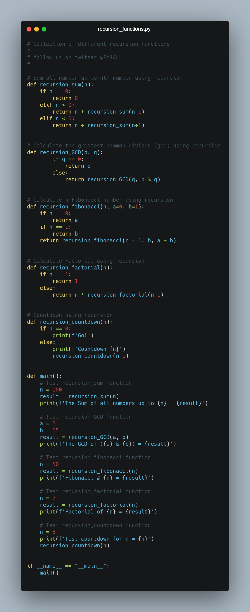
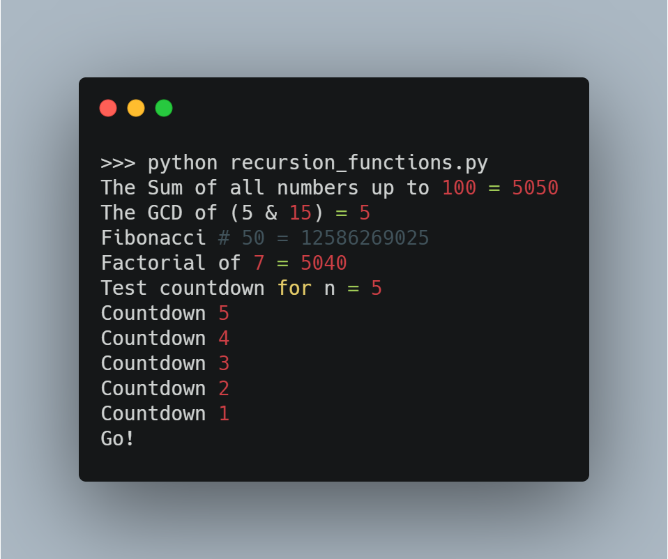

# recursion_functions



  Python Code On windows machine:

  clone recursion_functions repository on local machine.
  ```
  >git clone https://github.com/geosaleh/recursion_functions
  ```
  change directory to recursion_functions
  ```
  > cd recursion_functions/
  ```

Now its time to execute **recursion_functions.py**
```
>python recursion_functions.py
```
it will show following Output


## Download
:paperclip: [Download Here](https://github.com/geosaleh/recursion_functions/archive/refs/heads/master.zip)

Hope you'll install it in your computer just to try .
